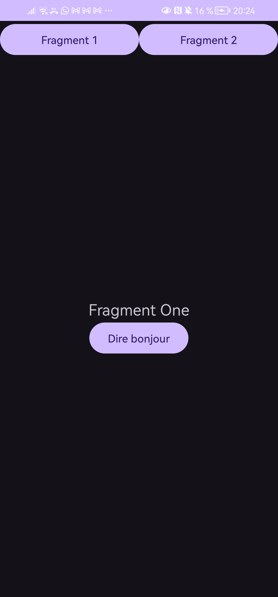
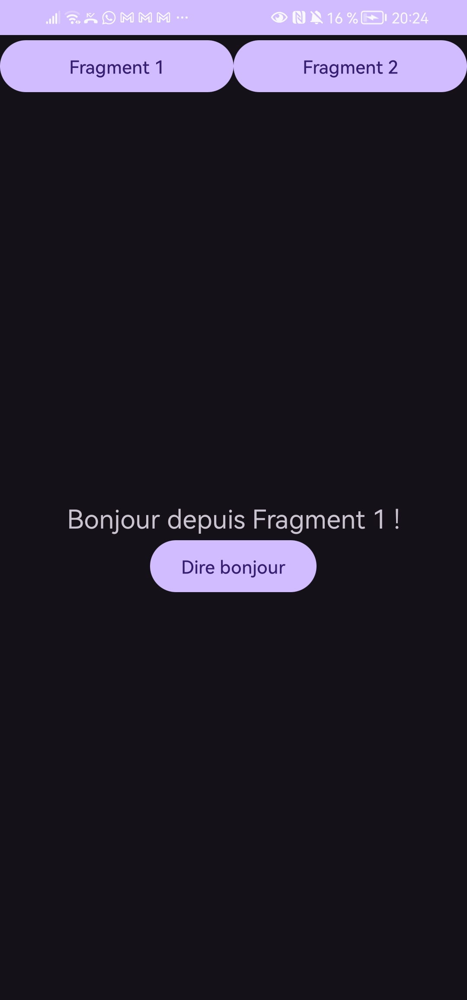
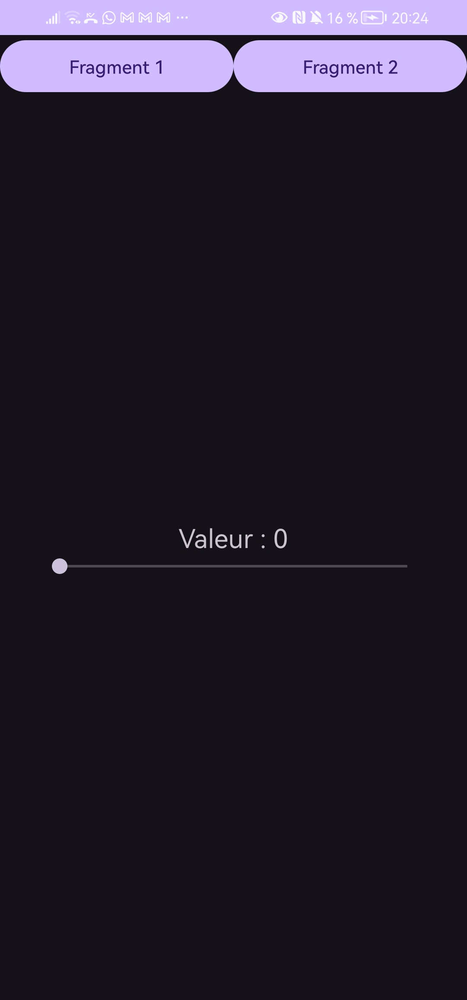
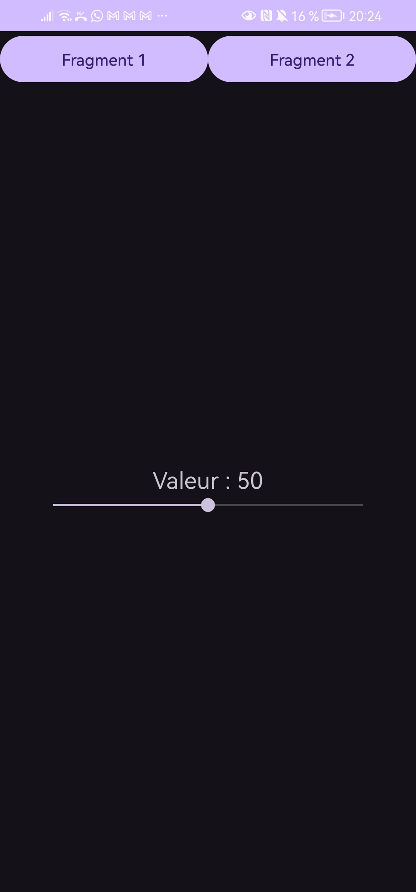

#  Android Fragments Lab

This project demonstrates the use of **Fragments in Android (Java)**.

---

## Features
- Navigation between two fragments
- Fragment 1:
  - Button to display a message
- Fragment 2:
  - SeekBar to update a value dynamically

---

## 🧩 Fragment 1

Displays a button that shows a message when clicked.

---

##  Fragment 2

Displays a SeekBar that updates the value in real-time.

---

## Technologies Used
- Java
- Android Studio
- FragmentManager
---

## ⚠️ Note
Images may not display due to network or GitHub restrictions.
